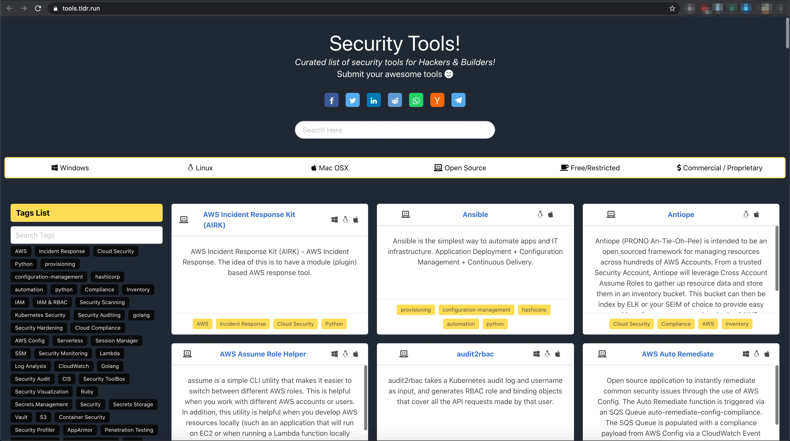

# Security Tools

[https://tools.tldr.run](https://tools.tldr.run)

Curated list of security tools for Hackers & Builders!

[](https://tools.tldr.run)

## Development & Setup

```bash
npm install
npm run serve
```

## Contributing

### Tool Submission

* The simplest way to contribute is adding new tools using [Google Form](https://forms.gle/yWbXkBtsDtqAqnTd6)
* Else, you can also make a pull request by following below steps
  * Fork the repository
  * Add new tool under `tools` folder with new tool name as filename (Example: `docker.json`)
  * The file schema should contain as follows. `name`, `description`, `tags`, `operating_system`, `availability` and `url` are mandatory

```json
{
    "name": "Docker",
    "description": "Docker is an open platform for developers and sysadmins to build, ship, and run distributed applications, whether on laptops, data center VMs, or the cloud.",
    "tags": [
        "containers",
        "devops",
        "automation",
        "golang"
    ],
    "operating_systems": [
        "linux",
        "mac",
        "windows"
    ],
    "license": "Apache-2",
    "availability": [
        "opensource",
        "free",
        "commercial"
    ],
    "github_url": "https://github.com/docker/docker-ce",
    "url": "https://www.docker.com/"
}
```

* Submit the merge request
* Happy contribution and thank you so much.

## Thanks & Acknowledgements

* [Varun A P](https://github.com/apvarun)
* [Madhu Akula](https://github.com/madhuakula)
